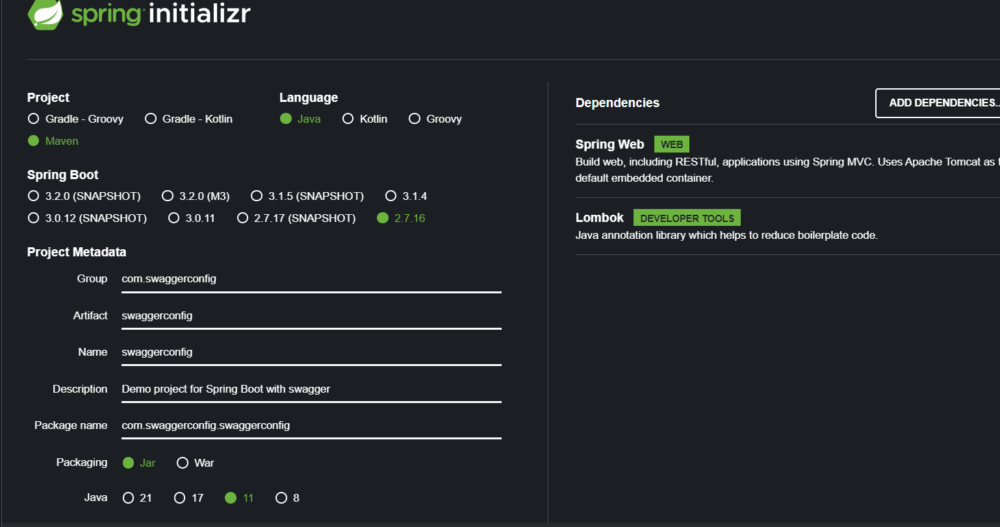

# Swagger 2 → SpringBoot 2



Si es un proyecto de 0 podemos crearlos en [https://start.spring.io](https://start.spring.io/)

Con las siguientes dependencias:

- Spring Web
- Lombok (opcional)
- ### Configuración del Swagger

  Agregamos la dependencia de Swagger manual en el POM.XML

    ```xml
    	<dependency>
    		<groupId>io.springfox</groupId>
    		<artifactId>springfox-boot-starter</artifactId>
    		<version>3.0.0</version>
    	</dependency>
    ```

  Ahora agregar una clase de configuración para el swagger con al anotación **@Configure**:

    ```java
    @Configuration
    public class SwaggerConfig {
    }
    ```

  Ahora agregamos la configuración en la clase recién creada con la **versión 2**:

    ```java
    @Bean
        public Docket api(){
            return new Docket(DocumentationType.SWAGGER_2)
                    .useDefaultResponseMessages(false)
                    .apiInfo(this.getApiInfo())
                    .select()
                    .apis(RequestHandlerSelectors.withClassAnnotation(RestController.class))
                    //.apis(RequestHandlerSelectors.any()) //Asi se muestran todos los controller
                    ///.apis(RequestHandlerSelectors.basePackage("com.devs4j.Rest.Controller"))//se pone el paquete a exponer
                    //.paths(PathSelectors.any())// asi se muestran todas las operaciones
                    // .paths(PathSelectors.ant("/users/*")) // se espesifica el cotroller a exponer
                    .paths(PathSelectors.any())// asi se muestran todas las operaciones
                    .build();
    
        }
    
        private ApiInfo getApiInfo() {
            // TODO Auto-generated method stub
            return new ApiInfoBuilder()
                    .title("Spring 2 | Swagger 2")
                    .description("Sin spring-boot-actuator-autoconfigure ")
                    .version("1.0")
                    //.license("La licenica")
                    //.contact(new Contact("Erwin","www.pagina.com", "correo@coore.com"))
                    .build();
        }
    ```

  Ya ahora agregamos al archivo **application** (yml/properties) lo siguiente:

    ```yaml
    spring:
      mvc:
        pathmatch:
          matching-strategy: ant_path_matcher
    ```

- ### Configuración de Swagger + Spring-boot-actuator-autoconfigure

  Cuando en un proyecto se Agrega la dependencia de Actuator-Autoconfigure, hay que agregar más configuraciones para que el Swagger se muestre correctamente.

  Primero tenemos que Hacer los pasos de ‘**Configuración del Swagger**’

  Ahora Adiccional si el proyecto ya contiene la siguiente dependencia *(Spring-boot-actuator-autoconfigure*) o si por algún motivo se tiene que agrega la, abría que hacer pasos adicionales  para que el Swagger siga funcionando:

    ```xml
    <!-- Autoconfigure-->
    	<dependency>
    		<groupId>org.springframework.boot</groupId>
    		<artifactId>spring-boot-actuator-autoconfigure</artifactId>
    		<version>x.x.x</version>
    	</dependency>
    ```

  Ahora dentro de la **Misma clase** donde se encuentra el método **Main** hay que agregar los siguientes 2 métodos:

    ```java
    @Bean
    	public WebMvcEndpointHandlerMapping webEndpointServletHandlerMapping(WebEndpointsSupplier webEndpointsSupplier,
    																		 ServletEndpointsSupplier servletEndpointsSupplier, ControllerEndpointsSupplier controllerEndpointsSupplier,
    																		 EndpointMediaTypes endpointMediaTypes, CorsEndpointProperties corsProperties,
    																		 WebEndpointProperties webEndpointProperties, Environment environment) {
    		List<ExposableEndpoint<?>> allEndpoints = new ArrayList();
    		Collection<ExposableWebEndpoint> webEndpoints = webEndpointsSupplier.getEndpoints();
    		allEndpoints.addAll(webEndpoints);
    		allEndpoints.addAll(servletEndpointsSupplier.getEndpoints());
    		allEndpoints.addAll(controllerEndpointsSupplier.getEndpoints());
    		String basePath = webEndpointProperties.getBasePath();
    		EndpointMapping endpointMapping = new EndpointMapping(basePath);
    		boolean shouldRegisterLinksMapping = this.shouldRegisterLinksMapping(webEndpointProperties, environment,
    				basePath);
    		return new WebMvcEndpointHandlerMapping(endpointMapping, webEndpoints, endpointMediaTypes,
    				corsProperties.toCorsConfiguration(), new EndpointLinksResolver(allEndpoints, basePath),
    				shouldRegisterLinksMapping);
    	}
    ```

    ```java
    private boolean shouldRegisterLinksMapping(WebEndpointProperties webEndpointProperties, Environment environment,
    											   String basePath) {
    		return webEndpointProperties.getDiscovery().isEnabled() && (StringUtils.hasText(basePath)
    				|| ManagementPortType.get(environment).equals(ManagementPortType.DIFFERENT));
    	}
    ```

    - En caso de necesitar que imports se utilizan

        ```java
        package comstrategy.exemplestrategy;
        
        import org.springframework.boot.SpringApplication;
        import org.springframework.boot.actuate.autoconfigure.endpoint.web.CorsEndpointProperties;
        import org.springframework.boot.actuate.autoconfigure.endpoint.web.WebEndpointProperties;
        import org.springframework.boot.actuate.autoconfigure.web.server.ManagementPortType;
        import org.springframework.boot.actuate.endpoint.ExposableEndpoint;
        import org.springframework.boot.actuate.endpoint.web.*;
        import org.springframework.boot.actuate.endpoint.web.annotation.ControllerEndpointsSupplier;
        import org.springframework.boot.actuate.endpoint.web.annotation.ServletEndpointsSupplier;
        import org.springframework.boot.actuate.endpoint.web.servlet.WebMvcEndpointHandlerMapping;
        import org.springframework.boot.autoconfigure.SpringBootApplication;
        import org.springframework.context.annotation.Bean;
        import org.springframework.core.env.Environment;
        import org.springframework.util.StringUtils;
        
        import java.util.ArrayList;
        import java.util.Collection;
        import java.util.List;
        
        @SpringBootApplication
        public class ExempleStrategyApplication {
        
        	public static void main(String[] args) {
        		SpringApplication.run(ExempleStrategyApplication.class, args);
        	}
        
        	//esto es para swagger, tambien se agrega una configuración al yml
        
        	@Bean
        	public WebMvcEndpointHandlerMapping webEndpointServletHandlerMapping(WebEndpointsSupplier webEndpointsSupplier,
        																		 ServletEndpointsSupplier servletEndpointsSupplier, ControllerEndpointsSupplier controllerEndpointsSupplier,
        																		 EndpointMediaTypes endpointMediaTypes, CorsEndpointProperties corsProperties,
        																		 WebEndpointProperties webEndpointProperties, Environment environment) {
        		List<ExposableEndpoint<?>> allEndpoints = new ArrayList();
        		Collection<ExposableWebEndpoint> webEndpoints = webEndpointsSupplier.getEndpoints();
        		allEndpoints.addAll(webEndpoints);
        		allEndpoints.addAll(servletEndpointsSupplier.getEndpoints());
        		allEndpoints.addAll(controllerEndpointsSupplier.getEndpoints());
        		String basePath = webEndpointProperties.getBasePath();
        		EndpointMapping endpointMapping = new EndpointMapping(basePath);
        		boolean shouldRegisterLinksMapping = this.shouldRegisterLinksMapping(webEndpointProperties, environment,
        				basePath);
        		return new WebMvcEndpointHandlerMapping(endpointMapping, webEndpoints, endpointMediaTypes,
        				corsProperties.toCorsConfiguration(), new EndpointLinksResolver(allEndpoints, basePath),
        				shouldRegisterLinksMapping);
        	}
        
        	//esto es para swagger, tambien se agrega una configuración al yml
        	private boolean shouldRegisterLinksMapping(WebEndpointProperties webEndpointProperties, Environment environment,
        											   String basePath) {
        		return webEndpointProperties.getDiscovery().isEnabled() && (StringUtils.hasText(basePath)
        				|| ManagementPortType.get(environment).equals(ManagementPortType.DIFFERENT));
        	}
        
        }
        ```


URL:
localhost:8080/swagger-ui/